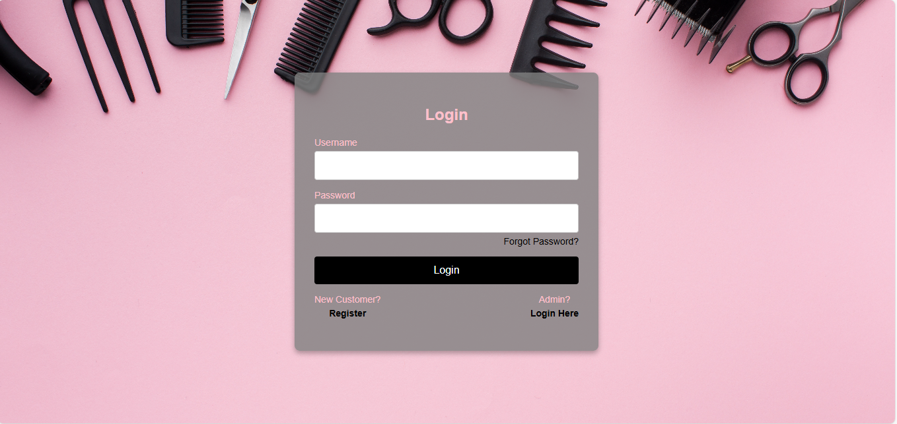
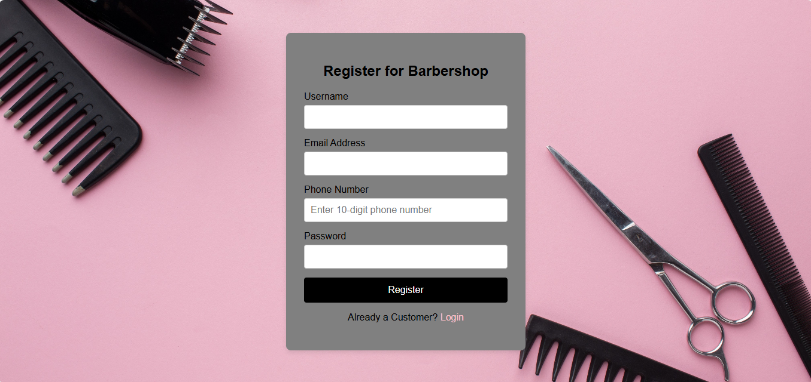
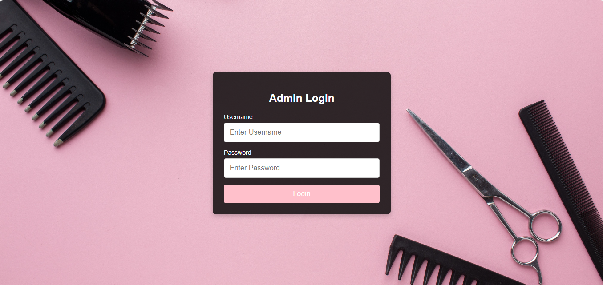
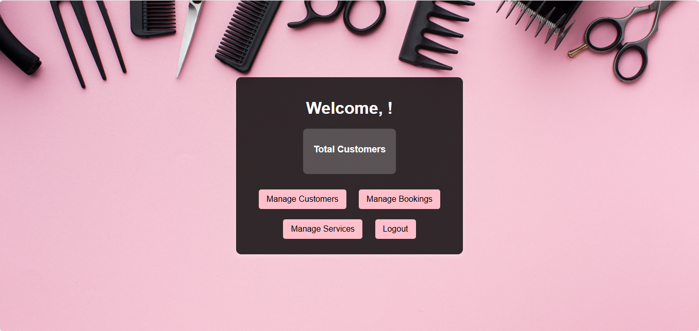
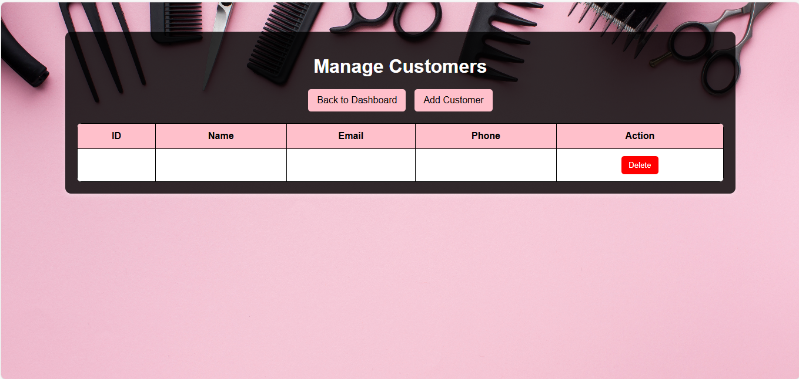
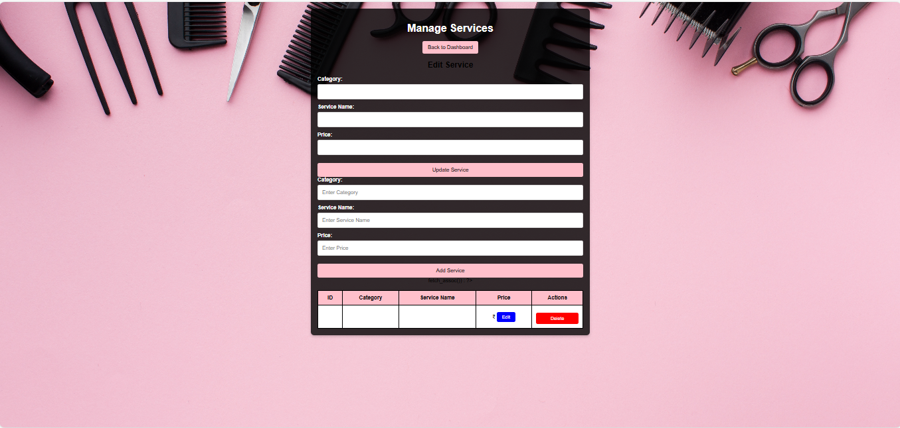
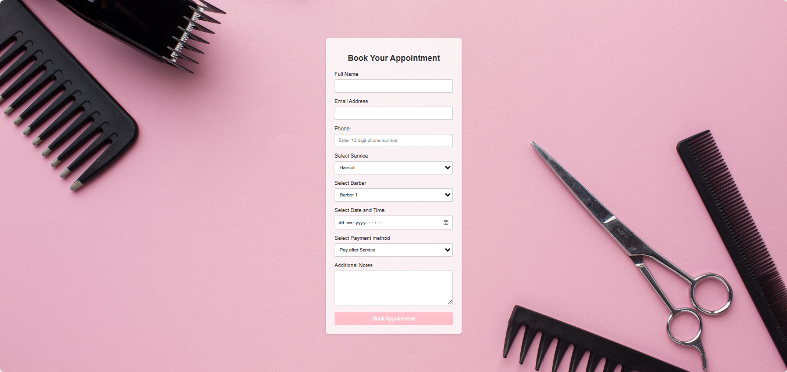

# 💈 Barbershop Management System

A complete web-based application designed to streamline and digitalize the daily operations of a barbershop. This academic project covers everything from customer registration to billing, making it easier for barbershop owners to manage their services efficiently.

🔗 **Live Demo**: [https://barbershop.wuaze.com/index.html](https://barbershop.wuaze.com/index.html)

---

## 📸 Demo Screenshots  

| **Main Login Page** | **Customer Register** | **Customer Dashboard** |  
|----------------------|-----------------------|-------------------------|  
|  |  |  |  

| **Admin Login** | **Admin Dashboard** | **Manage Customers** |  
|-----------------|----------------------|-----------------------|  
|  |  |  |  

| **Manage Services** | **Book Appointment** |  
|---------------------|----------------------|  
|  |  |  

---

## 📌 Features

- ✅ Customer Registration & Login  
- ✅ Appointment Booking System  
- ✅ Admin Dashboard to manage users, services, and bookings  
- ✅ Service Management (Add/Edit/Delete)  
- ✅ Billing System with invoice generation  
- ✅ Responsive Design for mobile and desktop  
- ✅ Clean and user-friendly UI  

---

## 🛠️ Tech Stack

| Layer       | Technologies                |
|-------------|-----------------------------|
| Frontend    | HTML5, CSS3, JavaScript     |
| Backend     | PHP                         |
| Database    | MySQL                       |
| Hosting     | Wuaze.com (Free Hosting)    |

---

## 📁 Folder Structure

```bash
📦barbershop-management-system
 ┣ 📂images
 ┃ ┗ 📂demo
 ┃    ┣ Main_login_Page.png
 ┃    ┣ Customer_Register.png
 ┃    ┣ customer_dashboard.png
 ┃    ┣ Admin_login.png
 ┃    ┣ Admin_dashboard.png
 ┃    ┣ Manage_Customers.png
 ┃    ┣ Manage_services.png
 ┃    ┗ Book_appointment.png
 ┣ 📜index.html
 ┣ 📜README.md
 ┣ 📜admin_dashboard.php
 ┣ 📜booking.php
 ┣ 📜db_connect.php
 ┗ ... other files
